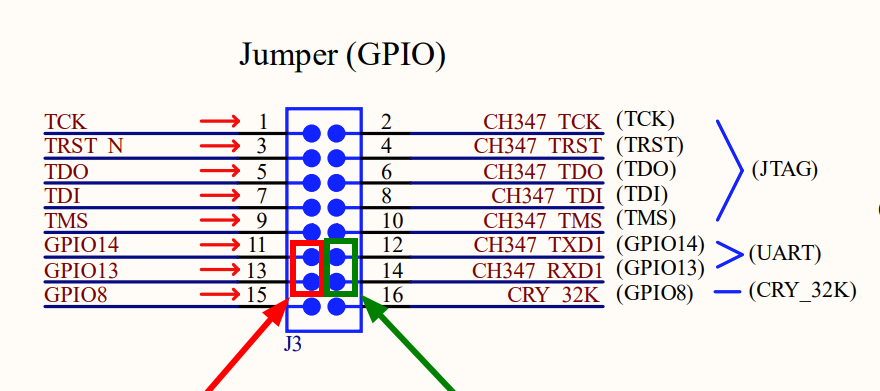

Copyright (c) Qualcomm Technologies, Inc. and/or its subsidiaries.
SPDX-License-Identifier: BSD-3-Clause-Clear

QCC730 UART Loopback Test
=========================

Test Overview
-------------

This test validates the robustness and data integrity of the QCC730 UART driver
implementation under continuous transmission using UART loopback. The test
transmits incrementing byte sequences (0-255, wrapping) and validates received
data using CRC16 checksums to ensure complete data integrity throughout the
transmission path.

Loopback hardware connection will disable logs on console so only way to see
test running and results is by connecting LED and/or logic analyzer (see details
below).

Hardware Requirements
---------------------

UART Loopback Connection
~~~~~~~~~~~~~~~~~~~~~~~~

By default test is using UART Option 1 (GPIO14 TX, GPIO13 RX). Connect TX to the
RX directly on the J3 connector on the board (pins 11 and 13 on J3 connector).
Pins 12 and 14 can stay disconnected. 

Picture from electrical schematic:

LED Indicator
~~~~~~~~~~~~~~~~~~~~~~~~

* LED connected to GPIO1 for visual test feedback
* Connection: GPIO A1 -> LED Anode -> Current Limiting Resistor -> GND
* LED polarity: Active HIGH

Logic analyzer (optional)
~~~~~~~~~~~~~~~~~~~~~~~~~~

It is possible to connect logic analyzer to the GPIO14 TX, GPIO13 RX and monitor
pins during the test. Output if formatted to ASCII characters will show console
like logs (evidence below).

Test
----

UART Loopback Test Validates reliable bidirectional UART communication with data
integrity verification:

* **TX Thread**: Continuously transmits incrementing byte sequence.
* **RX Thread**: Receives and validates all transmitted data.
* **Data Validation**: CRC16 checksum verification on 32KB validation buffers.
* **Concurrent Execution**: Both threads run simultaneously at equal priority.

**Test Parameters**:

* Test duration: 5000 ms (5 seconds)
* Validation buffer size: 32 KB per direction (TX/RX)
* UART configuration: 115200 baud, 8N1 (8 data bits, no parity, 1 stop bit)
* RX ring buffer: 4 KB
* Data pattern: Incrementing bytes with automatic wraparound

**Success Criteria**: 

* TX count must equal RX count (zero data loss)
* No UART errors (``-EBUSY`` conditions)
* CRC checksums must match between transmitted and received data
* No ring buffer overflows

LED Visual Feedback
~~~~~~~~~~~~~~~~~~~

The test provides real-time visual feedback through an LED indicator connected
to GPIO A1. The LED behavior follows a specific pattern that allows quick
identification of test status without monitoring serial output.

LED Signal Timeline
^^^^^^^^^^^^^^^^^^^

.. code-block:: text

   Time:     0s      5s      10s     15s     20s     25s
   
   PASS:     BLINK   OFF     BLINK   ON----- 
   
   FAIL:     BLINK   OFF     BLINK   OFF----
   
   Legend:
   BLINK = 5 fast blinks (500ms on/off)
   OFF   = LED Solid OFF
   ON    = LED Solid ON

LED Behavior
^^^^^^^^^^^^

**Phase 1: Test Start (0-5s)**

* Pattern: 5 fast blinks (ON 500ms, OFF 500ms)
* Purpose: Signals test initialization and start

**Phase 2: Test Running (5-10s)**

* Pattern: LED Solid OFF (dark)
* Purpose: Indicates active data transmission in progress

**Phase 3: Test End (10-15s)**

* Pattern: 5 fast blinks (ON 500ms, OFF 500ms)
* Purpose: Signals test completion and result calculation

**Phase 4: Final Result (15-20s)**

* **PASS**: LED Solid ON for 5 seconds
* **FAIL**: LED Solid OFF for 5 seconds

Configuration Options
---------------------

The test behavior can be modified by changing compile-time parameters defined in
``main.c``:

.. code-block:: text

   #define TEST_DURATION_MS                      5000U   // Test duration in milliseconds
   #define VALIDATION_BUFFER_SIZE                32768UL // Buffer size for CRC validation
   #define TX_THREAD_PRIORITY                    5       // TX thread priority
   #define RX_THREAD_PRIORITY                    5       // RX thread priority
   #define LED_BLINK_DURATION_MS                 500     // LED blink period
   #define LED_BLINK_TOTAL_OBSERVING_TIME_MS     5000    // LED result display duration

Debug Statistics
~~~~~~~~~~~~~~~~

When ``CONFIG_UART_QCC730_DEBUG=y`` is enabled in ``prj.conf``, additional
statistics are collected and reported:

.. code-block:: text

  [00:00:20.921,000] \x1B[0m<inf> uart_test: === Transmission Statistics ===\x1B[0m
  [00:00:20.928,000] \x1B[0m<inf> uart_test: Bytes transmitted: 51853\x1B[0m
  [00:00:20.935,000] \x1B[0m<inf> uart_test: Bytes received: 51853\x1B[0m
  [00:00:20.941,000] \x1B[0m<inf> uart_test: Bytes lost: 0\x1B[0m
  [00:00:20.947,000] \x1B[0m<inf> uart_test: Throughput: 10368 bytes/sec (82944 bits/sec)\x1B[0m
  [00:00:20.956,000] \x1B[0m<inf> uart_test: Measured effective rate: ~114048 baud\x1B[0m
  [00:00:20.964,000] \x1B[0m<inf> uart_test: ISR fires: 52803\x1B[0m
  [00:00:20.970,000] \x1B[0m<inf> uart_test: Buffer overflows: 0\x1B[0m
  [00:00:20.976,000] \x1B[0m<inf> uart_test: RX calls on empty buffer: 61693\x1B[0m
  [00:00:20.983,000] \x1B[0m<inf> uart_test: Test PASSED\x1B[0m

Known Limitations
-----------------

* **Console Interference**: Test uses the console UART, requiring logging to be
  disabled during active transmission to prevent data contamination.
* **Validation Buffer Size**: CRC validation limited to first 32 KB of
  transmitted data. Actual transmission may exceed this, but only first 32 KB is
  checksummed.
* **Polling Overhead**: The ``uart_poll_in()`` polling approach results in high
  "RX calls on empty buffer" counts, which is expected and not an error.
* **LED**: LED provides convenient visual feedback, it is not required for test
  execution. Test will continue and logs can be viewed using logic analyzer.
  Either LED or Logic analyzer are needed to confirm test started and executed.

Building and Running
--------------------

Test should be build as any other test case for the board without any special
arguments. 

.. code-block:: text

  west build -p always -b qcc730mi zephyr/tests/drivers/uart/uart_loopback

After flashing test will automatically start. It is not possible to
automate it with `west twister` tool as console logs are not available and
twister can not validate results. 